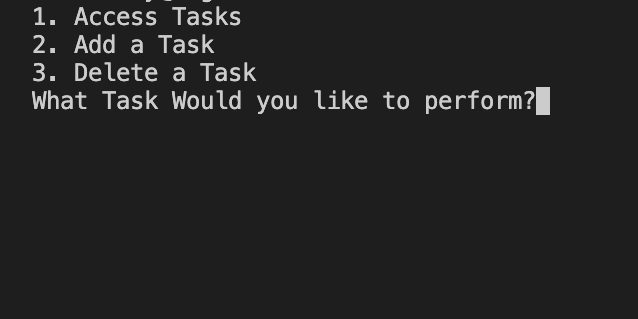
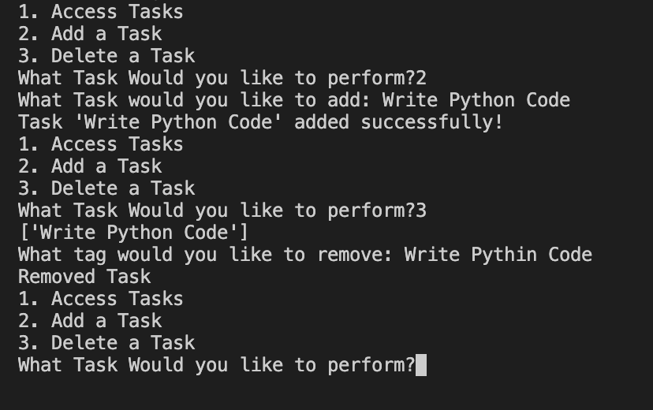

# To-Do-List

## Table of Contents

* [Introduction](#introduction)
* [Features](#features)
* [Installation](#installation)
* [Technologies Used](#technologies-used)
* [Usage](#usage)
* [Screenshots](#screenshots)
* [Future Developments](#future-developments)
* [Contact](#contact)
* [License](#license)

## Introduction

This is a To Do list that allows users to organize their day by accessing, adding, and deleting tasks.

## Features

* User friendly prompts that ask which operation they would like to perform.
* Ability to access all tasks.
* Ability to add a new task.
* Ability to delete a task.

## Technologies Used

* Python Language

## Installation

To use this project locally, follow these steps:

1. Clone the repository to your local machine.
2. Enter `main.py`.

## Usage

Navigate to your terminal

* Start the application by running `main.py`.
* Identify the prompted question that asks whether to access, add, or delete tasks.
* Enter the number 1.
* Notice the application returns a message indicating that there are no tasks saved.
* Enter the number 2 when asked whether to access, add, or delete tasks.
* Enter a task.
* Identify the application has returned this new task.
* After the initial prompt is asked again, enter 1.
* Identify the new task.
* After the initial prompt is asked again, enter 3.
* Notice the list of tasks or task is printed again.
* Enter the task that was just added.
* Notice the message returned indicating that the task has been deleted.
* After the initial prompt is asked again, enter 1.
* Notice that there are no longer any tasks. 

## Screenshots

### Initial Prompt

### Adding and Deleting Task

## Future Developments

- Produce a front end to enable futher interactivity for users.
- Allow for tasks to be updated.
- Enable more information to be stored including task time and date.
- Allow users to check off finished tasks to enhance user experience.

## Contact

If there are any questions or feedback, feel free to reach out via: 

* Github Issues: [Github](http://Github.com/Taylor-Brandon)

* Email: [Email](mailto://taylorbrandon.dev@gmail.com)

## License

